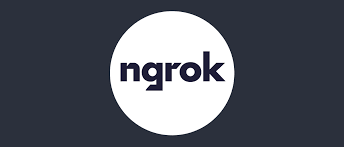
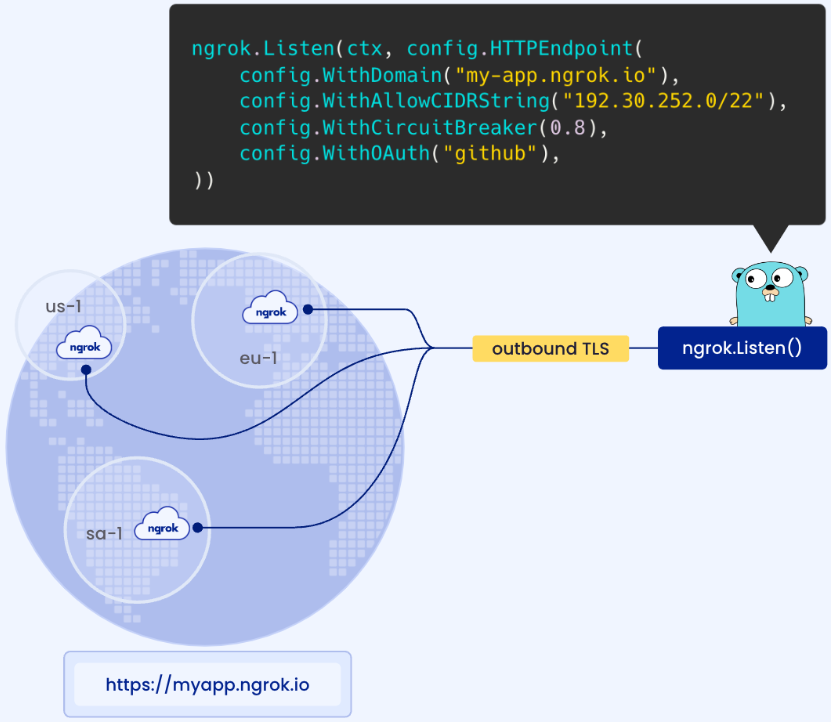

  

Introducing ngrok-go: Ingress to Your Go Apps as a net.Listener.

## What is it?

ngrok-go lets developers serve Go apps on the internet in a single line of code without setting up low-level network primitives like IPs, certificates, load balancers and even ports! Applications using ngrok-go listen on ngrok’s global ingress network but they receive the same interface any Go app would expect (net.Listener) as if it listened on a local port by calling net.Listen(). This makes it effortless to integrate ngrok-go into any application that uses Go's net or net/http packages.
 
## Why ngrok was built? 

* Ingress should be a high-level abstraction
* Ingress should be environment-independent
* Ingress shouldn’t require sidecars

## Documentation

Go to [ngrok-go](https://ngrok.com/blog-post/ngrok-go) for the full example documentation.

## Screenshots

### How ngrok-go works

The example app above doesn’t listen on any ports, how is that possible? When you call ngrok.Listen(), ngrok-go initiates a secure and persistent outbound TLS connection to ngrok’s ingress-as-a-service platform and transmits your configuration requirements — i.e. URL, authentication, webhook verification, and IP restrictions. The ngrok service sets up your configuration across all of our global points of presence in seconds and returns a URL for your application.

## Script for creating a ngrok application and exposing it with an external address - TLS/SSL

*  To create a ngrok application and expose it, first clone the repository as I give you below.
*  git clone git@github.com:roger-amorim-dv/ngrok-expose-app.git.
*  set up your ngrok auth token on the bash file. You can read more about here (https://dashboard.ngrok.com/get-started/your-authtoken)
*  Apply the shell this way: $bash execute.sh.
